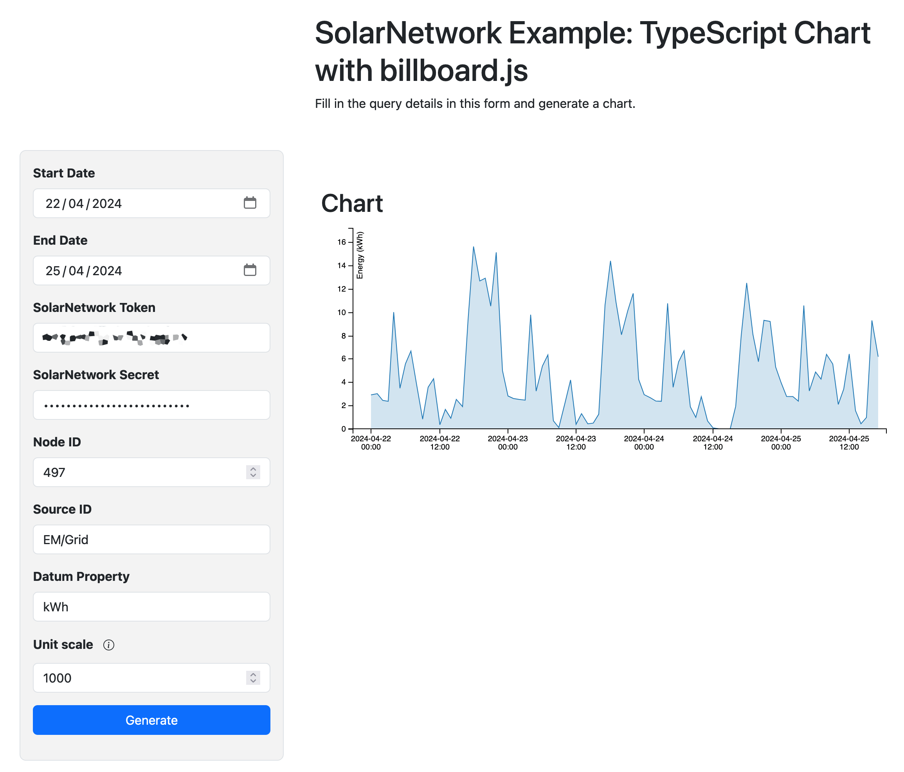

# SolarNetwork Example: TypeScript Chart with billboard.js

This project is a little web app to show the basics of using the SolarNetwork API
in a TypeScript project to render an accumulating meter reading datum stream in a chart with the [billboard.js][billboard] project to generate a chart out of a SolarNetwork datum stream.

You can see the example in action here:

<https://go.solarnetwork.net/dev/example/typescript-chart-billboard/>



# Key aspects

There are a few key aspects of this example worth pointing out.

## SolarNetwork API

The [solarnetwork-api-core][sn-api-core] package is [included in the project][sn-api-core-dep], which provides many helpful utilities in both TypeScript and JavaScript for working with the SolarNetwork API.

```json
{
	"dependencies": {
		"solarnetwork-api-core": "^2.0.1"
	}
}
```

## Token authentication with Fetch API

The example demonstrates using [SolarNetwork token authentication][sn-api-auth] with the browser [Fetch API][fetch].

First the demo [imports the AuthorizationV2Builder][import-sn-auth] class and [creates a reusable instance][auth-instance] in an `auth` variable:

```ts
import { AuthorizationV2Builder } from "solarnetwork-api-core/lib/net";

const auth = new AuthorizationV2Builder();
```

A `change` form event handler listens for changes to the form's token and secret fields, and [saves the credentials][save-creds] for future API calls:

```ts
// save credentials
auth.tokenId = settingsForm.snToken.value;
auth.saveSigningKey(settingsForm.snTokenSecret.value);
```

When it comes time to make a SolarNetwork API request, the app [generates a `Headers` object][auth-headers] for the API URL that includes the necessary `Authorization`, `X-SN-Date`, and `Accept` header values and initiates the `fetch()` call:

```ts
function authorizeUrl(url: string): Headers {
	const authHeader = auth.reset().snDate(true).url(url).buildWithSavedKey();
	return new Headers({
		Authorization: authHeader,
		"X-SN-Date": auth.requestDateHeaderValue!,
		Accept: "application/json",
	});
}

const headers = authorizeUrl(findSourcesUrl);
const res = await fetch(findSourcesUrl, {
	method: "GET",
	headers: headers,
});
```

## URL helper

The `SolarQueryApi` class is also imported, which provides methods to help generate SolarNetwork API URLs:

```ts
import { SolarQueryApi } from "solarnetwork-api-core/lib/net";

const urlHelper = new SolarQueryApi();
```

For example, to discover the available sources to populate the **Source ID** menu, the application [creates a `DatumFilter` object][create-datum-filter] and populates the **Node ID**, **Start Date**, and **End Date** values from the form, and then [uses the `findSourcesUrl(filter)` method][find-sources-url] to generate the API URL:

```ts
import { DatumFilter } from "solarnetwork-api-core/lib/domain";

// create a filter object with the form's node ID, start date, and end date values
const filter = new DatumFilter();
filter.nodeId = Number(nodeId);
if (startDate) {
	startDate.setHours(0, 0, 0, 0);
	filter.localStartDate = startDate;
}
if (endDate) {
	endDate.setHours(0, 0, 0, 0);
	filter.localEndDate = endDate;
}

// use the findSourcesUrl() method to generate the API URL
const findSourcesUrl = urlHelper.findSourcesUrl(filter);
```

## Discover the available sources for the given node

The [the previous](#url-helper) section actually showed how the app takes the **Node ID**, **Start Date**, and **End Date** values from the form and uses the `SolarQueryApi` helper's `findSourcesUrl(filter)` method to [query SolarNetwork for the source IDs available matching that criteria][discover-sources]. The API used here is the [/nodes/sources][reportable-node-sources] method, that [returns a list of node/source objects][reportable-node-sources-res] like this:

```json
{
	"success": true,
	"data": [
		{ "nodeId": 1, "sourceId": "Main" },
		{ "nodeId": 1, "sourceId": "Main1" }
	]
}
```

Thus the results are processed and all the available `sourceId` values are populated in the **Source ID** form menu:

```ts
// make API request using Fetch API
const res = await fetch(findSourcesUrl, {
	method: "GET",
	headers: headers,
});

// wait for response
const json = await res.json();
if (json && Array.isArray(json.data)) {
	// clear out and re-populate the source IDs menu
	while (settingsForm.snSourceId.length) {
		settingsForm.snSourceId.remove(0);
	}
	if (json.data.length) {
		settingsForm.snSourceId.add(new Option("Choose...", ""));
		// for each response object, add a menu option for that source ID
		for (const src of json.data) {
			const opt = new Option(src.sourceId, src.sourceId);
			settingsForm.snSourceId.add(opt);
		}
	}
}
```

## Discover the available properties for a datum stream

In order to populate the **Datum Property** form menu with a list of the available meter-style properties of the selected **Source ID** the app queries the [/datum/stream/meta/node][datum-stream-meta-node] method using the **Node ID** and **Source ID** values in the form. This method [returns a list of datum stream metadata objects][datum-stream-meta-node-res] and looks like this:

```json
{
	"success": true,
	"data": [
		{
			"streamId": "9458020e-789b-49d5-8a29-d9b53fde622f",
			"zone": "Pacific/Auckland",
			"kind": "n",
			"objectId": 123,
			"sourceId": "/meter/1",
			"i": [
				"watts",
				"current",
				"voltage",
				"frequency",
				"apparentPower",
				"reactivePower"
			],
			"a": ["wattHours"]
		}
	]
}
```

Since the app only wants to display meter reading values, the [_accumulating_][datum-prop-class] properties in the metadata objects's `a` property are then populated as options in the **Datum Property** form menu:

```ts
// create a filter with the node and source ID values from the form
const filter = new DatumFilter();
filter.nodeId = Number(nodeId);
filter.sourceId = sourceId;

// construct the API URL to call
const streamMetaUrl =
	urlHelper.baseUrl() + "/datum/stream/meta/node?" + filter.toUriEncoding();

// generate authorization headers using the token credentials in the form
const headers = authorizeUrl(streamMetaUrl);

// make API request using Fetch API
const res = await fetch(streamMetaUrl, {
	method: "GET",
	headers: headers,
});

// wait for response
const json = await res.json();

// clear out and re-populate the property names menu
while (settingsForm.snDatumProperty.length) {
	settingsForm.snDatumProperty.remove(0);
}
if (json.data.length) {
	settingsForm.snDatumProperty.add(new Option("Choose...", ""));
	for (const meta of json.data) {
		// add all accumulating properties to menu
		if (Array.isArray(meta.a)) {
			for (const p of meta.a) {
				settingsForm.snDatumProperty.add(new Option(p, p));
			}
		}
	}
}
```

## Query datum stream

Once the date range, node, source, and property are all configured, the app can query SolarNetwork for the actual datum stream. It uses the [/datum/stream/reading][datum-stream-reading-list] method to query for hourly meter readings over the given date range.

> **Note** there are other query methods that could be used, such as [/datum/stream/datum][datum-stream-datum-list] or [/datum/list][datum-list] or [/datum/reading][datum-reading]. The choice on which to use is up to the needs of your app.

The `/datum/stream/reading` API returns a result like this:

```json
{
	"success": true,
	"meta": [
		{
			"streamId": "7714f762-2361-4ec2-98ab-7e96807b32a6",
			"zone": "Pacific/Auckland",
			"kind": "n",
			"objectId": 123,
			"sourceId": "/power/1",
			"i": ["watts", "current", "voltage", "frequency"],
			"a": ["wattHours"]
		}
	],
	"data": [
		[
			0,
			[1650667326308, null],
			[12326, 600, 8290, 14222],
			null,
			[230.19719, 600, 228.2922, 233.12324],
			[50.19501, 600, 49.94322, 50.20012],
			[6472722, 2819093834849, 2819100307571]
		]
	]
}
```

The app converts each stream result object into a `GeneralDatum` object that looks like this:

```js
{
	nodeId: 123,
	sourceId: "/power/1",
	date: Date(1650667326308),
	watts:12326,
	voltage:230.19719,
	frequency:50.19501,
	wattHours:6472722
}
```

The code involved looks like this:

```ts
// create filter with Hour aggregation, node/source IDs, and date range from the form
const filter = new DatumFilter();
filter.aggregation = Aggregations.Hour;
filter.nodeId = Number(nodeId);
filter.sourceId = sourceId;
if (startDate) {
	startDate.setHours(0, 0, 0, 0);
	filter.localStartDate = startDate;
}
if (endDate) {
	endDate.setHours(0, 0, 0, 0);
	filter.localEndDate = endDate;
}

// construct the API URL to call
const streamDataUrl =
	urlHelper.baseUrl() +
	"/datum/stream/reading?readingType=" +
	DatumReadingTypes.Difference.name +
	"&" +
	filter.toUriEncoding();

// generate authorization headers using the token credentials in the form
const headers = authorizeUrl(streamDataUrl);

// make API request using Fetch API
const res = await fetch(streamDataUrl, {
	method: "GET",
	headers: headers,
});

// wait for response
const json = await res.json();
if (
	!(
		json &&
		Array.isArray(json.data) &&
		Array.isArray(json.meta) &&
		json.meta.length
	)
) {
	return Promise.reject("No data available.");
}

// convert stream results into GeneralDatum to more easily use in charts
const result: GeneralDatum[] = [];

// create a DatumStreamMetadataRegistry to associate result objects with stream metadata
const reg = DatumStreamMetadataRegistry.fromJsonObject(json.meta);
if (!reg) {
	return Promise.reject("JSON could not be parsed.");
}
for (const data of json.data) {
	// get the stream metadata for this result
	const meta = reg.metadataAt(data[0]);
	if (!meta) {
		continue;
	}

	// convert stream result object into GeneralDatum object
	const d = datumForStreamData(data, meta)?.toObject();
	if (d) {
		result.push(d as GeneralDatum);
	}
}
return Promise.resolve(result);
```

## Render chart with billboard.js

Once the list of `GeneralDatum` has been obtained, an area [chart is rendered][render-chart] using time on the x-axis and **Property Name** values on the y-axis. This is done using [billboard.js][billboard] and looks like this:

```ts
// c looks like {propName: "foo", displayName: "kWh", scale: 1}
const c = seriesConfig(config);
bb.generate({
	data: {
		json: datum,
		keys: {
			x: "date",
			// render the "Datum Property" form value
			value: [c.propName],
		},
		type: area(),
	},
	axis: {
		x: {
			type: "timeseries",
			tick: {
				count: 6,
				fit: false,
				format: "%Y-%m-%d %H:%M",
			},
			padding: {
				left: 20,
				right: 10,
				unit: "px",
			},
		},
		y: {
			label: c.displayName,
			tick: {
				// scale the value using the "Unit scale" form value
				format: function (v: number) {
					return v / c.scale;
				},
			},
		},
	},
	legend: {
		hide: true,
	},
	zoom: {
		enabled: zoom(),
		type: "drag",
	},
	tooltip: {
		format: {
			title: tooltipDateFormat,
			name: () => "Example Chart",
		},
	},
	point: {
		focus: {
			only: true,
		},
	},
	bindto: "#chart",
});
```

# Building from source

To build yourself, clone or download this repository. You need to have
Node 16+ installed. Then:

```sh
# initialize dependencies
npm ci

# run development live server on http://localhost:8080
npm run dev

# build for production
npm run build
```

Running the `build` script will generate the application into the `dist/` directory.

[auth-instance]: https://github.com/SolarNetwork/solarnetwork-example/blob/1.3.0/TypeScript/chart-billboard/src/main/ts/sn.ts#L17
[auth-headers]: https://github.com/SolarNetwork/solarnetwork-example/blob/1.3.0/TypeScript/chart-billboard/src/main/ts/sn.ts#L42-L55
[billboard]: https://naver.github.io/billboard.js/
[create-datum-filter]: https://github.com/SolarNetwork/solarnetwork-example/blob/1.3.0/TypeScript/chart-billboard/src/main/ts/sn.ts#L85-L94
[datum-list]: https://github.com/SolarNetwork/solarnetwork/wiki/SolarQuery-API#datum-list
[datum-prop-class]: https://github.com/SolarNetwork/solarnetwork/wiki/SolarNet-API-global-objects#datum-property-classifications
[datum-reading]: https://github.com/SolarNetwork/solarnetwork/wiki/SolarQuery-API#datum-reading
[datum-stream-meta-node]: https://github.com/SolarNetwork/solarnetwork/wiki/SolarQuery-API#datum-stream-metadata-list
[datum-stream-meta-node-res]: https://github.com/SolarNetwork/solarnetwork/wiki/SolarQuery-API#datum-stream-metadata-list-response
[datum-stream-datum-list]: https://github.com/SolarNetwork/solarnetwork/wiki/SolarQuery-Stream-API#datum-stream-datum-list
[datum-stream-reading-list]: https://github.com/SolarNetwork/solarnetwork/wiki/SolarQuery-Stream-API#datum-stream-reading-list
[datum-stream-reading-list-res]: https://github.com/SolarNetwork/solarnetwork/wiki/SolarQuery-Stream-API#datum-stream-reading-list-response
[discover-sources]: https://github.com/SolarNetwork/solarnetwork-example/blob/1.3.0/TypeScript/chart-billboard/src/main/ts/sn.ts#L96-L119
[fetch]: https://developer.mozilla.org/en-US/docs/Web/API/Fetch_API
[sn-api-auth]: https://github.com/SolarNetwork/solarnetwork/wiki/SolarNet-API-authentication-scheme-V2
[find-sources-url]: https://github.com/SolarNetwork/solarnetwork-example/blob/1.3.0/TypeScript/chart-billboard/src/main/ts/sn.ts#L96
[render-chart]: https://github.com/SolarNetwork/solarnetwork-example/blob/1.3.0/TypeScript/chart-billboard/src/main/ts/main.ts#L30-L33
[reportable-node-sources]: https://github.com/SolarNetwork/solarnetwork/wiki/SolarQuery-API#reportable-node-sources
[reportable-node-sources-res]: https://github.com/SolarNetwork/solarnetwork/wiki/SolarQuery-API#reportable-node-sources-response
[sn-api-core]: https://www.npmjs.com/package/solarnetwork-api-core
[sn-api-core-dep]: https://github.com/SolarNetwork/solarnetwork-example/blob/1.3.0/TypeScript/chart-billboard/package.json#L44
[import-sn-auth]: https://github.com/SolarNetwork/solarnetwork-example/blob/1.3.0/TypeScript/chart-billboard/src/main/ts/sn.ts#L6-L9
[save-creds]: https://github.com/SolarNetwork/solarnetwork-example/blob/1.3.0/TypeScript/chart-billboard/src/main/ts/sn.ts#L77-L78
